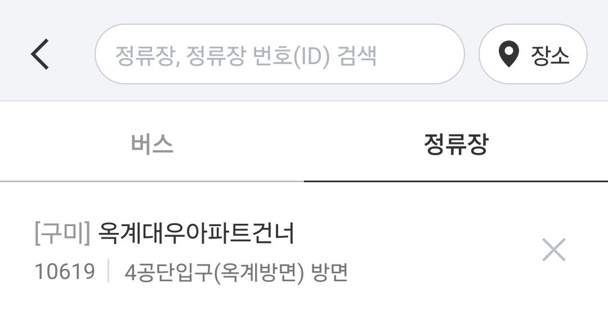

# 데이터파일 링크

---

### 국토교통부_전국 버스정류장 위치정보_20241028
- https://www.data.go.kr/data/15067528/fileData.do
- 데이터 수정일: 2024-11-07

 

# 활용 방안

---

- 정적으로 `버스정류장 위치정보`를 db에 넣어둘 수 있는 데이터셋이다
- 도시명에 해당하는 정류장들을 알맞게 조회할 수 있다
  - 정류장명, 모바일단축번호를 통한 빠른 검색이 가능하다

    
### +) 의문점
  - 전국 스마트 버스 앱, 카카오맵에서는 모바일 단축번호가 없는 경우 조회조차 되지 않는다. 왜일까?
  - 제주도 버스정류소는 단축번호 없는데 검색이 가능하다. 이건 뭘까?

 

# 데이터 내용

---

- 정류장번호: GMB1130
- 정류장명: 인동정류장 종점
- 위도: 36.10878225
- 경도: 128.4227043
- 정보수집일: 2024-10-28
- 모바일단축번호: 11130
- 도시코드: 37050
- 도시명: 경상북도 구미시
- 관리도시명: 구미BIS

