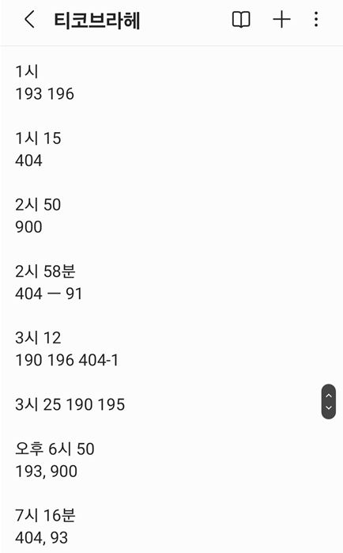

### 구독한 버스 정류장의 버스 도착 시각을 한 달 단위로 추적하는 프로젝트

 

### 기획 의도
구미는 버스 배차간격이 굉장히 길다. 구미 인동에 사는 주효림이 구미역에 갈 때 버스를 타는 원래 루트는 다음과 같다.
1. 인동 -> 구미역으로 가는 모든 버스의 출발지와 출발시간을 확인한다.
2. 내가 타는 정류장과 떨어진 거리를 가늠해서 도착 시간을 +- 10분정도로 계산한다.
3. 계산한 시각 10분전에 출발한다.
4. 너무 빨리 도착하고, 20분을 기다려서 버스를 타고 구미역에 간다.

 

주효림은 자주 타는 버스의 경우, 도착시각을 아예 기록을 해두기도 하였다. 기록해둔 사진을 첨부하면 다음과 같다.

(+ 기록해둘 당시, 과학사개론이라는 교양을 듣고있었다. 티코브라헤는 직접 눈으로 관측한 꽤나 정밀한 데이터를 남겼고, 이는 케풀러법칙의 바탕이 되었다. 그래서 메모장 이름을 티코브라헤로 지었다)

 

정류장마다 버스 정보를 기록하기 너무 힘들었던 주효림은 새로운 서비스를 개발하여 불편함을 해결하고자 하였다.
버스 API와 조금의 추가기능을 넣은 서비스를 고안하기 시작하였다. 구현할 때의 생각의 흐름은 다음과 같다.

- 버스정보 시스템에는 버스 도착시간 정보가 정확하게 뜨지는 않는데, 도착여부는 어느정도 뜨긴한다
- 이를 바탕으로 그냥 언제 도착했는지 기록해두고자 하였다
- 또한 비가 왔는지 안왔는지 여부에 따라 도착시간도 너무 달라져서(차가 막힘) 이에 따른 도착 정보도 저장하려고 한다 

 

### 기대효과
이제 비옴/비안옴 여부에 따라 버스 도착의 평균시간이 나올거고, 구미 버스 타기가 훨 편해질 것이다! 추운 날에 버스를 30분동안 기다릴 일도 없어질 것이다.

 

### 기능

1. 사용자가 버스 정류장, 버스 번호를 구독한다
2. 구독한 버스 정류장 + 버스에 대해, 하루 동안 버스가 해당 정류장에 도착한 시각들이 기록된다
   - 너무 쌓이는 건 원하지 않아서, 2주~3주 정도만 기록하고자 하였다
   - 날짜 별 도착한 시각이 기록되고, 평균 시각이 대표로 표시된다
   - 상세 날짜별 도착한 시각도 볼 수 있다 
3. 데이터는 날씨에 따라 달라질 수 있기 때문에 비 왔는지 안왔는지 여부도 체크하려고 한다

